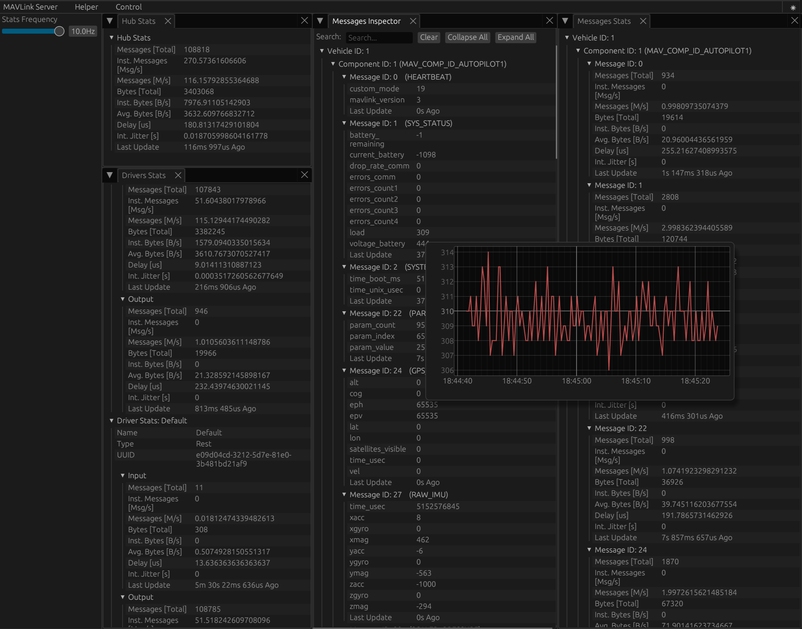

# MAVLink-Server

<div align="center">



</div>
<br>

<h4 align="center">
   A MAVLink service that allows drivers to implement features based on an internal MAVLink bus.<br>
   Currently, it provides router and broker features.
</h4>

[](https://github.com/bluerobotics/mavlink-server/actions/workflows/build.yml)

## As seen at the 2025 PX4 Developer Summit
[](https://youtu.be/zTlpceUuwQs?list=PLYy2pGCdhu7zVkfXvJkAEbT0V6CoyakMg&t=943 "Click to watch the presentation!")

## Features
- Web Interface via default web server ([0.0.0.0:8080](0.0.0.0:8080))
- Software and Vehicle control via REST API

#### Supported Endpoints
- TLog
- Serial
- TCP
- UDP
- Fake
- Zenoh
- WebSocket
- Rest (Compatible with [mavlink2rest](https://github.com/mavlink/mavlink2rest))

## Installation

Download the binaries from the [latest release](https://github.com/bluerobotics/mavlink-server/releases/latest).

## Usage

```bash
mavlink-server [OPTIONS] [ENDPOINTS]...
```

`[ENDPOINTS]` is a space-separated list of connection endpoints, that follows the same convention as other tools, such as mavlink-router, mavp2p, and etc.
Examples include serial ports, UDP/TCP sockets, or log readers.

## Endpoint Examples

### Serial connection:
```bash
serial:COM3:57600
serial:///dev/ttyACM0?baudrate=115200
```

### UDP:
```bash
udpserver://0.0.0.0:14550
udpclient://192.168.2.1:14550?direction=sender
```

### TCP:
```bash
tcpserver://0.0.0.0:5760
tcpclient://127.0.0.1:5760
```

### Log file playback:
```bash
tlogreader://C:/logs/flight.tlog
```
Fake MAVLink data (for testing):
```bash
fakesource://?period_us=1000000&system_id=42&component_id=66
```

## Web Interface

By default, the server runs a web API and WebSocket on:
```bash
http://0.0.0.0:8080
```
You can change this with:
```bash
--web-server 0.0.0.0:9000
```
The WebSocket endpoint for MAVLink messages is typically:
```bash
ws://<host>:8080/v1/rest/ws
```

## Options

| Option | Description | Default |
|--------|-------------|---------|
| `-v, --verbose` | Enable debug logs | — |
| `--web-server <ADDR>` | HTTP/WebSocket server bind address | `0.0.0.0:8080` |
| `--log-path <DIR>` | Directory for logs | `./logs` |
| `--enable-tracing-level-log-file` | Enable detailed trace logs in log file | — |
| `--streamreq-disable` | Disable stream requests (not implemented) | — |
| `--udp-server-timeout <SEC>` | UDP client inactivity timeout in seconds | `10` |
| `--mavlink-system-id <ID>` | MAVLink System ID | `1` |
| `--mavlink-component-id <ID>` | MAVLink Component ID | `191` |
| `--mavlink-heartbeat-frequency <Hz>` | Heartbeat frequency in Hz | `1` |
| `--send-initial-heartbeats` | Send initial burst of heartbeats (0.1s apart) | — |
| `--mavlink-version <1\|2>` | MAVLink protocol version | `2` |
| `--default-api-version <VER>` | Default REST API version (removes path prefix) | `1` |
| `--zenoh-config-file <PATH>` | Path to Zenoh config file | — |
| `-h, --help` | Show help message | — |
| `-V, --version` | Show version info | — |


## Example Commands

Connect to a Pixhawk via serial and expose WebSocket API
```bash
mavlink-server serial:COM3:57600 --web-server 0.0.0.0:8080
```
Connect to SITL via UDP and serve on port 9090
```bash
mavlink-server udpserver://0.0.0.0:14550 --web-server 0.0.0.0:9090
```
Replay a log file and connect Cockpit
```bash
mavlink-server tlogreader://./logs/test.tlog --web-server 0.0.0.0:8080
```
