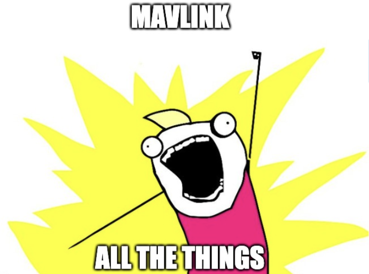

# MAVLink-Server

   

 

<h4 align="center">
   A MALink service that allows drivers to implement features based on an internal MAVLink bus. 
   Currently, it provide router and broker features.
</h4>

## Installation

Download the binaries available on the [latest release](https://github.com/bluerobotics/mavlink-server/releases/latest).
